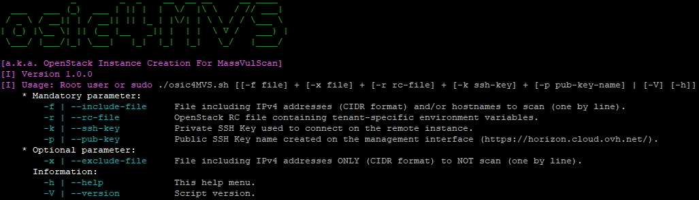
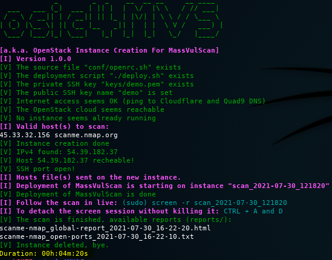
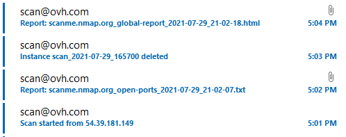

# osic4MVS :bat: [English version](https://github.com/choupit0/osic4MVS/blob/master/README-EN.md)
[](https://github.com/choupit0/osic4MVS/releases)
[](https://github.com/choupit0/osic4MVS/blob/master/LICENSE)
[](https://github.com/choupit0/osic4MVS/graphs/commit-activity)
[](https://www.gnu.org/software/bash/)
# Description
osic4MVS a.k.a. **O**penStack **I**nstance **C**reation For **M**ass**V**ul**S**can

Script Bash qui permet de déployer et de lancer rapidement le scanner [MassVulScan](https://github.com/choupit0/MassVulScan "MassVulScan: quickly identify your open ports and if they are vulnerable") depuis des instances OpenStack du Cloud Public d'OVH.



Avec cette technologie et les serveurs d'OVH, on limite et on contrôle les coûts (consommation à la demande).

A ce jour **0.03$ CAD par scan** (plusieurs hôtes sur tous les ports TCP/UDP). Cela évite de devoir louer un serveur tous les mois.

L'autre avantage, c'est d'avoir une **adresse IPv4 qui change à chaque fois** (pour contourner fail2ban par exemple et tester ses serveurs).

# Pré-requis du script
**Seuls les OS de la famille Debian sont concernés pour le moment.**

**ICMP Echo Reply (ping) et SSH port 22 doivent êtres ouverts depuis le serveur qui lance ce script vers l'Internet.**

Liste des paquets à installer (compatible python 2.x et python 3.x) :
```
apt update
apt install python-openstackclient s-nail screen dnsutils ipcalc netcat
```
**Ou:**
```
apt update
apt install python3-openstackclient s-nail screen dnsutils ipcalc netcat
```

# Pré-requis OVH
En attendant le guide détaillé, voici les étapes dans les grandes lignes : 

1) Créer un compte chez OVHcloud : [OVHcloud link](https://ca.ovh.com/manager/public-cloud "OVHcloud link to create account") (gratuit pour la création)
2) Créer un utilisateur dédié et récupérer les variables d'environnement (fichier OpenStack RC) :

**Public Cloud / Management Interfaces / Users & Roles** (rôle Compute Operator)

3) Choisir sa région, créer un jeu de clés SSH, récupérer votre clé privée et retenir son nom :

**Public Cloud / Management Interfaces / Horizon / Key Pairs**

# Déroulement du script
Exemple d'un scan complet de "scanme.nmap.org", 2*65535 ports :
1) Vérification de l'accessibilité du Cloud Public d'OVH
2) Vérification des instances OpenStack existantes
3) Analyse du ou des fichiers sources (noms d'hôtes et/ou adresses IPv4, format CIDR)
4) Création de l'instance puis attente de la disponibilité du serveur
5) Déploiement du scanner MassVulScan + envoi du ou des fichiers hosts
6) Lancement du scan MassVulScan : Masscan puis Nmap + vulners.nse
7) Récupération des rapports en local via SCP
8) Suppression des sessions screen et OpenStack

**Un dessin vaut mieux qu'un long discours, la résultat en image :**



**Coût chez OVH: 0.03$ CAD**

**Durée du script: ~5 minutes**

# Suivre le déroulement
Il est possible de suivre le déroulement du script via une **session screen** (phase d'installation + scan).

Et en paramétrant les variables "smtp_server", "recipient" et "auth_user_pass" il vous sera possible de **recevoir des courriels** :
- Lors du démarrage effectif du scan, un courriel est envoyé avec en objet l'adresse IPv4 du serveur
- Une fois le scan terminé, deux courriels sont envoyés avec en pièce jointe le ou les fichiers TXT + rapport HTML
- une fois la supression effective de l'instance OpenStack, un courriel est envoyé vous en informant

**Pour l'authentification, l'utilisateur et le mot de passe sont spécifiés et encodés dans un URI (voir l'aide dans le script).**

Exemple des courriels recus suite au scan de "scanme.nmap.org" :



# Rapports
Les rapports fournis :
- Un rapport HTML contenant le résultat complet de l'analyse
- Un fichier TXT contenant la liste des hosts avec les ports découverts
- Un fichier TXT permettant de se focaliser sur les hosts vulnérables (si il y a lieu)

# Installer et utiliser le script
**Installation** :
```
git clone https://github.com/choupit0/osic4MVS.git
cd osic4MVS
chmod +x osic4MVS.sh && chmod +x deploy.sh
```

**Modifiez le fichier OpenStack RC pour ne pas saisir le mot de passe de l'utilisateur (user-XXXXXXXXXXXXXX)** :
```
#export OS_PASSWORD=$OS_PASSWORD_INPUT
export OS_PASSWORD="**************************"
```

**Protégez votre fichier RC et votre clé privée SSH, obligatoire pour lancer le script** :
```
chmod 600 [path to private SSH key]
chmod 600 [path to RC file]
```

**Lancement** :
./osic4MVS.sh -f [path to hosts file] -r [path to RC file] -k [path to private SSH key] -p [public SSH key name]

**Exemple** :
```
root@HTB:~/osic4MVS# ./osic4MVS.sh -f /tmp/scanme -r /tmp/rc_file -k /tmp/private_key -p scan-key
```

# A faire
- Guide pour la partie OVH
- Ajouter le changelog
- Traduire le README en anglais

